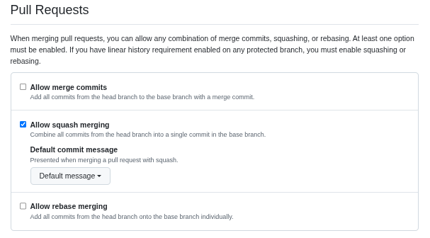
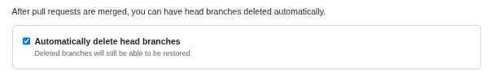

# The Standard

We want you to feel like a surfer who moves forward effortlessly.
To help you get there, we wrote The Standard.
It is [Khaldoun](https://khaldoun.xyz)'s way of work codified.
During their first weeks, all our members integrate these standards.
We give it to you free of charge. In return, we ask you to apply it on a daily basis.

This document is continuously updated.

## Standard #1: Weekly priorities check

Every Monday we write down around 3 focus areas for the week.
And we reflect on last week's progress.
Everybody is invited to comment.

We do it in a company-internal public format, but that is less important.
Just take some time and give your week an intention.

## Standard #2: Track To Dos as issues

To keep track of relevant tasks we use Github Issues. The most important
tasks are flagged as `prio1`. The next important tasks as `prio2`.

When you don't know what to do and struggle to come up with a clear answer,
pick one of the open issues. If you don't know which one, just ask somebody
who likely knows.

## Standard #3: PRs follow issues

When you identify a problem that you want to resolve,
create an issue first. Then you create a Pull Request (PR)
that addresses this issue. In your PR description, link the issue that is
resolved with this PR by writing `closes #[issue_number]`. Github will
automatically close the issue once you merge the PR.

This means that the ideal PR is short and concise.
The only occasions where this does not apply is i) fixing acute bugs or
ii) combining minor changes into one PR.

## Standard #4: PRs are fully tested, clean & easy to understand

We do not ask for a review without making sure that basic checks have passed.
At the minimum, every PR has successfully run a pre-commit hook. The
description & commit messages are clear and with enough detail.

Do not ask for a review on a PR in the `draft` stage.
Before requesting a PR review from anybody,
set the stage of the PR to `ready for review`.

## Standard #5: Respond to all git comments

If reviewers invest the time to review your work, you'll find the time to
respond to their feedback. This also applies to AI-generated feedback.
Do not leave comments in your PR uncommented or unresolved.

## Standard #6: Resolve merge conflicts promptly

Generally, we recommend to fix merge conflicts by creating an additional commit.
The most typical case for merge conflicts stems from another PR that was merged
into `main`. Since you don't have the newest changes from `main` in your `feature`
branch yet, you need to bring them in.

First, pull the most recent changes to `main` from your remote branch `origin`:

- `git checkout main`
- `git pull origin main`

Next, merge your local `main` branch into your `feature` branch:

- `git checkout feature`
- `git merge main`

If there are merge conflicts, the merge will stop and you'll be asked
to resolve the merge conflicts in the files that are mentioned in the
error message first. Open each of these files and resolve your conflicts.

Then, add your updated file with `git add file.py` and run `git commit`.
Confirm the commit message.

## Standard #7: Properly set up git repositories

We properly set up your git repositories on Github to reduce our mental load.

1. Only allow squash merging: After creating the repo, go to General settings
   on Github, scroll to the `Pull Requests` section and
   only select `Allow squash merging`.

   

2. Auto-delete a branch after merging: In the same settings section, activate
   `Automatically delete head branches`.

   
