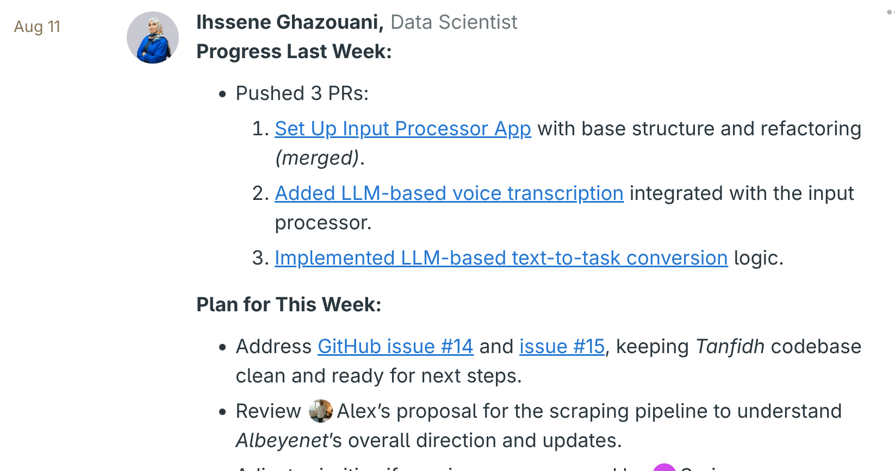
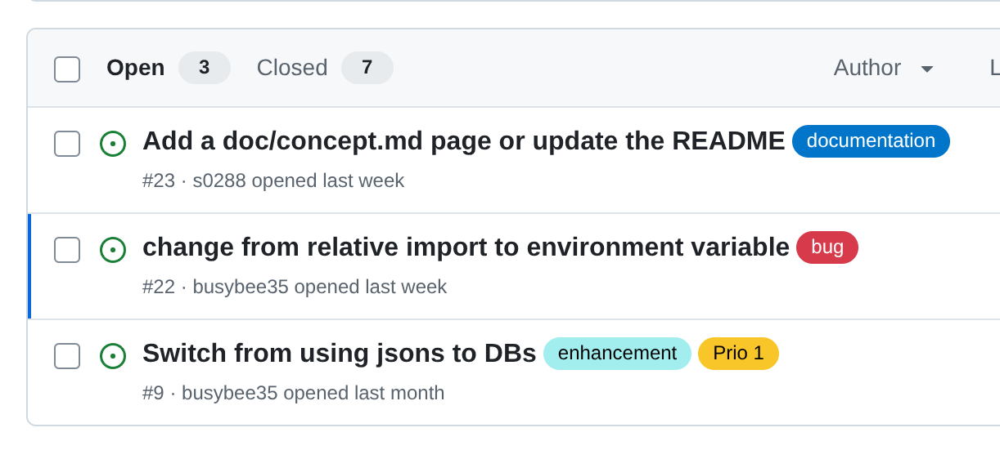

# The Standard

Khaldoun wants to help its clients do more with less.
This starts with you.  
We want you to feel like a surfer who moves forward effortlessly.  
To help you get there, we created The Standard. It is our way of work codified.

The Standard is our greatest asset and we teach it to you free of charge.  
In return, we expect you to apply it on a daily basis.

Should you ever decide to leave Khaldoun and join another organisation, they'll be
very lucky to have you - thanks in part to The Standard.

## Standard #1: Asynchronous weekly updates

Every Monday you'll reflect on last week's progress
and write up a plan for the coming week.
Everybody is invited to comment.

Writing down your thoughts helps you think things through.
And if there is no relevant update in weeks, we'll notice.

## Standard #2: Track To Dos as Github Issues

To keep track of relevant tasks we use Github Issues. The most important
tasks are flagged as `prio1`. The next important tasks as `prio2`.

When you don't know what to do and struggle to come up with a clear answer,
pick one of the open issues. If you don't know which one, just ask somebody
who likely knows.

## Standard #3: PRs follow Issues

When you identify a problem that you want to resolve,
create an issue first. Then you create a PR that addresses this issue.
After the PR is merged, you close the issue.
Repeat.

This means that the ideal PR is short and concise.

The only occasions where this does not apply is i) fixing acute bugs or
ii) combining minor changes into one PR.

## Standard #4: PRs are fully tested, clean & easy to understand

We do not open PRs to be notified about typos or that the app isn't working.
At the minimum, every PR has successfully run a pre-commit check. The
description & commit messages are clear and with enough detail.

## Standard #5: Respond to all git comments

If reviewers invest the time to review your work, you'll find the time to
respond to their feedback. This also applies to AI-generated feedback.

## Standard #6: Resolve merge conflicts promptly

Generally, we recommend to fix merge conflicts by creating an additional commit.
The most typical case for merge conflicts stems from another PR that was merged
into `main`. Since you don't have the newest changes from `main` in your `feature`
branch yet, you need to bring them in.

First, pull the most recent changes to `main` from your remote branch `origin`:

- `git checkout main`
- `git pull origin main`

Next, merge your local `main` branch into your `feature` branch:

- `git checkout feature`
- `git merge main`

If there are merge conflicts, the merge will stop and you'll be asked
to resolve the merge conflicts in the files that are mentioned in the
error message first. Open each of these files and resolve your conflicts.

Then, add your updated file with `git add file.py` and run `git commit`.
Confirm the commit message.

## Standard #7: Only allow squash merging

Without squash merging, your git history will quickly look like a spaghetti ball.

1. Only allow squash merging: After creating the repo, go to General settings
   on Github, scroll to the `Pull Requests` section and
   only select `Allow squash merging`.
2. Auto-delete a branch after merging: In the same settings section, activate
   `Automatically delete head branches`.
3. Bonus: Whenever possible, create a new repo
   with [Assaas](https://github.com/khaldoun-xyz/assaas),
   Khaldoun's git repo template.

## Our tech stack

Check out [Altadaim](https://github.com/khaldoun-xyz/altadaim)
to get a better understanding of how we think about our tech stack.
