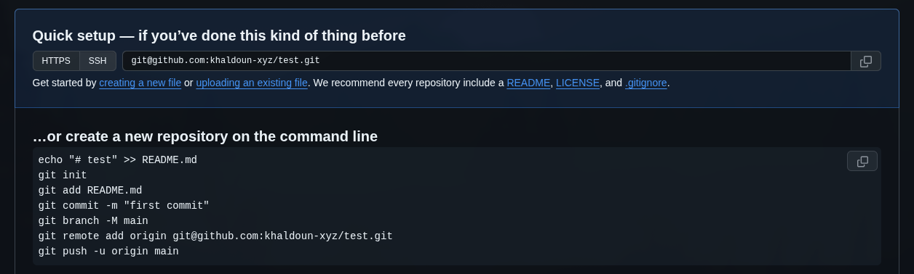

# The Standard

The Standard is [Khaldoun](https://khaldoun.xyz)'s way of work codified.
During your first weeks, we expect you to integrate these standards.

This document is continuously updated.

## Our PRs follow issues

When you identify a problem that you want to resolve,
create an issue first. Then create a Pull Request (PR)
that addresses this issue. In your PR description, link the issue that is
resolved with this PR by writing `Closes #[issue_number]`. Github will
automatically close the issue once you merge the PR.

The ideal PR is short and concise because it only resolves a single issue.

## Our PRs are simple, clean & easy to understand

Before we ask for a review, each of our PRs was reviewed by an AI assistant.
The description & commit messages are clear and with enough detail.
We do not review PRs that are not marked as `ready for review`.

## We respond to all git comments

If reviewers invest the time to review your work, you'll find the time to
respond to all their feedback. This also applies to AI-generated feedback.
Do not leave comments in your PR uncommented or unresolved.
A simple "I see your point but prefer to leave it unchanged" may be sufficient.

## We resolve merge conflicts promptly

Generally, we fix merge conflicts as soon as possible by
creating an additional commit.
The most typical case for merge conflicts stems from another PR that was merged
into `main`. Since you don't have the newest changes from `main` in your `feature`
branch yet, you need to bring them in.

First, pull the most recent changes to `main` from your remote branch `origin`:

- `git checkout main`
- `git pull origin main`

Next, merge your local `main` branch into your `feature` branch:

- `git checkout feature`
- `git merge main`

If there are merge conflicts, the merge will stop and you'll be asked
to resolve the merge conflicts in the files that are mentioned in the
error message first. Open each of these files and resolve your conflicts.

Then, add your updated file with `git add file.py` and run `git commit`.
Confirm the commit message.

## We set specific settings on GitHub

We properly set up our git repositories on GitHub to reduce our mental load.

1. Only allow squash merging: After creating the repo, go to General settings
   on Github, scroll to the `Pull Requests` section and
   only select `Allow squash merging`.

   

2. Auto-delete a branch after merging: In the same settings section, activate
   `Automatically delete head branches`.

   

## Our code repositories follow a basic structure

When we start a new project, we follow these steps.

### 1) We set up a new git repo

- Create a repo within the Khaldoun organisation at <https://github.com/khaldoun-xyz>.
    Keep the newly created repo page open because you will
    copy the instructions later.
- On your laptop navigate to your Khaldoun repos, create a new directory
    with `mkdir REPO_NAME` and navigate to it with `cd REPO_NAME`.
- Copy-paste the instructions from your newly created repo page on GitHub.
    That way, you initialise a git repository and set up a remote branch.
    
- [Set specific settings](#we-set-specific-settings-on-github) in your
    GitHub repo.

### 2) We initialise a pixi project

- Run `pixi init` in the root of the repository.

### 3) We add further files

- Run `mkdir src tests docs .github` and `touch .gitignore README.md`.

### Basic repo structure

After these steps, our resulting repo structure looks like this:

  ```bash
  ├── .git/
  ├── .github/
  ├── .gitignore
  ├── docs/
  ├── pixi.lock
  ├── pixi.toml
  ├── README.md
  ├── src/
  └── tests/
  ```
