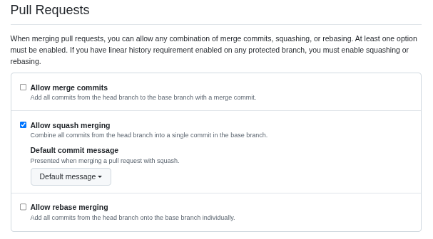
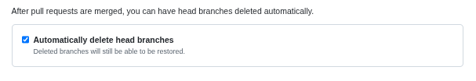

# Version control: git

Git's history is worth reading. Linus Torvalds, the creator of Linux,
created it in 2005:
[Linux Journal](https://www.linuxjournal.com/content/git-origin-story)

## Why?

- safely develop new features
- easily collaborate with others
- track your project's history & past releases

## How to set up your GitHub repos

We properly set up our git repositories on GitHub to reduce our mental load.

1. Only allow squash merging: After creating the repo, go to General settings
   on Github, scroll to the `Pull Requests` section and
   only select `Allow squash merging`.

   

2. Auto-delete a branch after merging: In the same settings section, activate
   `Automatically delete head branches`.

   

## Basic premise

- always maintain a working version of your code on a `main`/`master` branch
- implement features on a `feature/NAME` branch,
  fix issues on a `fix/NAME` branch
- if the `main` branch is ahead, merge those changes into your branch
  before opening a Pull Request (PR) (see [resolve merge conflicts](#how-to-resolve-merge-conflicts))
- keep your git history clean, esp. by only squash merging PRs
  (see [GitHub settings](#how-to-set-up-your-github-repos))

## important git commands

- `git init`
- `git remote add REMOTE_NAME REMOTE_URL`
- `git status`
- `git add .`
- `git commit -m "commit message"`
- `git push`
- `git log`
- `git pull` = `git fetch + git merge`
- `git fetch`
- `git branch`
- `git checkout -b NEW_BRANCH_NAME`
- `git stash`: store local changes in system memory
- `git stash pop`: revert `git stash`
- `git merge main`: Add a new commit that merges the changes from `main`
  into your feature branch.
- `git revert HEAD`: Add a new commit that undoes the previous commit
- `git reset HEAD~1`: Similar to `git revert` but changes the git
  history. Undo the previous commit and transform its changes
  to unstaged changes locally
- `git rebase -i HEAD~NUMBER_OF_COMMITS_YOU_WANT_TO_GO_BACK`:
  interactively rebase your history (e.g. for squashing commits)

## How to resolve merge conflicts

Generally, we fix merge conflicts as soon as possible by
creating an additional commit.
The most typical case for merge conflicts stems from another PR that was merged
into `main`. Since you don't have the newest changes from `main` in your `feature/NAME`
branch yet, you need to bring them in.

First, pull the most recent changes to `main` from your remote branch `origin`:

- `git checkout main`
- `git pull origin main`

Next, merge your local `main` branch into your `feature/NAME` branch:

- `git checkout feature/NAME`
- `git merge main`

If there are merge conflicts, the merge will stop and you'll be asked
to resolve the merge conflicts in the files that are mentioned in the
error message first. Open each of these files and resolve your conflicts.

Then, add your updated file with `git add file.py` and run `git commit`.
Confirm the commit message.
