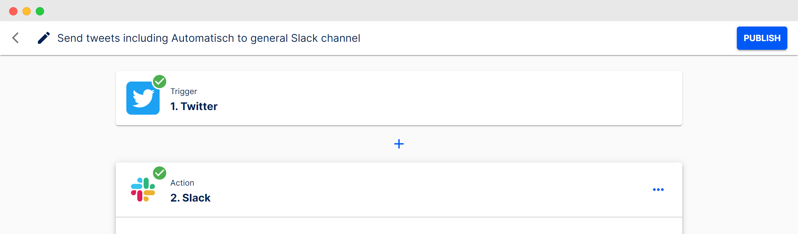
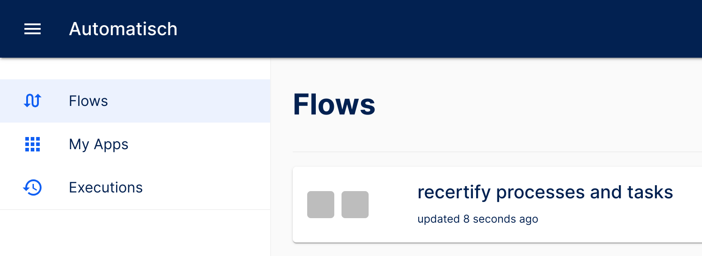

# Khaldoun's process library

Our eventual goal is the creation of autonomous
(i.e. highly automated) organisations.
To this end, we treat Khaldoun as our first test case.
We aim to design this company in a way to enable scalable automation.

Three critical elements for such a design are a company
orchestration layer, a process library and a recertification process.

- The orchestration layer is a light-weight, easy-to-switch hub
  where all automation tasks are registered.
- The process library is a central repository that contains all
  critical org processes.
- The recertification process is a recurring task that asks
  process owners to certify that the processes are up to date
  and as simple as possible.

## Process library

- [company orchestration](#company-orchestration)
  - process library (this section)
  - [recertify processes and tasks](#recertify-processes-and-tasks)
  - [register tasks in the orchestration layer](#register-tasks-in-the-orchestration-layer)
- recruiting
  - publish job description & receive applications
  - evaluate candidates
- training
  - evaluate language competence
  - teach mindset
  - teach skills
- [product maintenance](#product-maintenance)
  - [monitor product uptime](#monitor-product-uptime)
  - [send lugha summary statistics](#send-lugha-summary-statistics)
- product development
  - generate & explore ideas
  - align & execute

### company orchestration

#### recertify processes and tasks

owner: s0288

- The process is registered in the orchestration layer.
- The process recertification tool lists all processes.
  - Each process has a name, an owner, a status, a certification date,
    a trigger period (e.g. annual) and a history of edits to these data fields.

~~~mermaid
---
title: recertify processes & tasks
---
flowchart LR
  A[annual trigger] --> B[log status & reset]
  B --> C[notify all process owners]
  C --> |#1| D(do you need to update your process description?)
  C --> |#2| E[...]
  C --> |#3| F[...]
  D --> |yes| G(update the process in the library)
  D --> |no| H[end]
  G --> H
~~~

#### register tasks in the orchestration layer

owner: s0288

The orchestration layer is the central hub
where automation tasks are registered.
We develop independent modules
that are connected by the orchestration layer.

One candidate for this orchestration layer is automatisch.io:

- Screenshot of a flow:

- Screenshot of the folder structure:

### Product maintenance

#### monitor product uptime

owner: s0288

- The process is registered in the orchestration layer.

~~~mermaid
---
title: monitor product uptime 
---
flowchart LR
  A[15 minute trigger] --> |lugha| B1[test if url is available]
  A --> |...| B2[test if url is available]
  B1 --> |no| C[send Telegram message to admins]
  B1 --> |yes| D[end]
  C --> D[end]
  E[weekly trigger] --> F[test same urls as 15 min trigger]
  F --> |all alive| G[send uptime info as Telegram message to admins]
  F --> |at least one service offline| G
  G --> H[end]
~~~

#### send lugha summary statistics

owner: s0288

- The process is registered in the orchestration layer.

~~~mermaid
---
title: send lugha summary statistics
---
flowchart LR
  A[weekly trigger] --> B[collect summary statistics] 
  B --> C[send Telegram message to admins]
  C --> D[end]
~~~
